# Sistema de Reportes Avanzados - PR#8

## Resumen Ejecutivo

Este documento describe la implementación del sistema completo de reportes con narrativa dinámica, visualizaciones interactivas y exportación a PDF para el MVP 360°.

## 🎯 Objetivos Cumplidos

### 1. Infraestructura de Reportes ✅
- Sistema modular que combina datos dinámicos, narrativa y visualizaciones
- Plantillas narrativas con bloques modulares (Nivel, Sombra, Horizonte, Hoja de Ruta)
- Placeholders dinámicos tipo `{{variable}}` para personalización
- Generación automática basada en scores y métricas

### 2. Templates Narrativos ✅
- **Tono pastoral y constructivo**: Cercano pero profesional
- **Bloques modulares**:
  - **Nivel**: Explica el punto actual del evaluado
  - **Sombra**: Describe áreas críticas o riesgos latentes
  - **Horizonte**: Plantea visión de crecimiento futuro
  - **Hoja de Ruta**: Pasos claros y accionables
- Activación condicional según tipo de reporte y plan

### 3. PDF Profesional ✅
- Integración de jsPDF para generación de documentos
- Gráficos embebidos (radar, barras, distribución)
- Tablas con promedios, comparativas y distribuciones
- Narrativa generada dinámicamente
- Dos modos:
  - **Resumen gratuito**: One-page con gráfico principal
  - **Informe completo (Premium)**: Todas las secciones narrativas

### 4. Lógica de Negocio ✅
- Diferenciación por plan de usuario:
  - **Gratuito**: Solo resumen ejecutivo
  - **Premium**: Informe completo con narrativa y hoja de ruta
- Control mediante feature flags
- Caché de reportes generados

## 📁 Estructura de Archivos

### Backend (Cloud Functions)
```
360MVP-functions/functions/src/reports/
├── narrativeTemplates.js    # Sistema de plantillas narrativas
├── reportGenerator.js       # Generador principal de reportes
├── generateReport.js        # Cloud Functions para reportes
└── (otros archivos existentes)
```

### Frontend
```
src/
├── services/
│   ├── reportService.js    # Cliente para API de reportes
│   └── pdfGenerator.js      # Generador de PDFs
├── components/
│   └── ReportViewer.jsx    # Visualizador de reportes
└── pages/
    └── ReportView.jsx       # Página principal de reportes
```

## 🏗️ Arquitectura Técnica

### Flujo de Generación de Reportes

```mermaid
graph LR
    A[Usuario solicita reporte] --> B[Cloud Function: generateReport]
    B --> C[Obtener datos evaluación]
    C --> D[Calcular métricas]
    D --> E[Generar benchmarks]
    E --> F[Preparar datos narrativa]
    F --> G[Generar narrativa]
    G --> H[Estructurar reporte]
    H --> I[Guardar en Firestore]
    I --> J[Retornar reportId]
```



### Modelo de Datos

#### Estructura del Reporte
```javascript
{
  id: string,
  type: 'individual' | '360' | 'organizational',
  plan: 'gratuito' | 'premium',
  generatedAt: Date,
  
  metadata: {
    evaluationId: string,
    userId: string,
    userName: string,
    evaluationType: string,
    completedAt: Date,
    totalQuestions: number
  },
  
  metrics: {
    globalScore: number,
    dimensionScores: Object,
    categoryScores: Object,
    strengths: Array,
    weaknesses: Array,
    distribution: Object,
    statistics: Object
  },
  
  benchmarks: Object | null,  // Solo premium
  narrative: Object | null,    // Solo premium
  recommendations: Object | null, // Solo premium
  
  visualization: {
    charts: Array,
    tables: Array,
    layout: 'compact' | 'full'
  }
}
```

## 🎨 Sistema de Plantillas Narrativas

### Estructura de Plantillas
```javascript
{
  titulo: string,
  contenido: string,  // Con placeholders {{variable}}
  variables: Array    // Lista de variables requeridas
}
```

### Ejemplo de Plantilla (Nivel Intermedio)
```javascript
{
  titulo: "Tu Posición en el Camino",
  contenido: `Con un desempeño del {{scoreGlobal}}%, {{nombre}}, has alcanzado 
  un nivel {{nivel}} que te posiciona {{comparacionBenchmark}}. 
  Tus resultados muestran consistencia en {{areasConsistentes}} 
  y un desarrollo notable en {{areasEnProgreso}}.`,
  variables: ['scoreGlobal', 'nombre', 'nivel', 'comparacionBenchmark', 
              'areasConsistentes', 'areasEnProgreso']
}
```

### Variables Dinámicas Disponibles
- **Datos básicos**: nombre, fechaEvaluacion, tipoEvaluacion
- **Métricas**: scoreGlobal, nivel, top3Categorias, areasDebiles
- **Comparaciones**: comparacionBenchmark, percentil
- **Desarrollo**: oportunidadesFuturas, metaAspiracional, plazoEstimado
- **Acciones**: accion30_*, accion60_*, accion90_*

## 📊 Visualizaciones

### Gráficos Incluidos

#### 1. Radar Chart (Perfil de Competencias)
- Muestra todas las dimensiones evaluadas
- Escala 0-100%
- Colores diferenciados por performance

#### 2. Bar Chart (Análisis por Categorías)
- Comparación visual de categorías
- Colores gradientes para diferenciación
- Valores porcentuales visibles

#### 3. Distribution Chart (Distribución de Respuestas)
- Histograma de respuestas (1-5)
- Identifica tendencias de evaluación
- Útil para detectar sesgos

#### 4. Comparison Chart (Benchmarks)
- Tu score vs Promedio industria vs Top performers
- Solo disponible en plan premium
- Visualización horizontal para claridad

## 📄 Generación de PDF

### Estructura del PDF

1. **Portada**
   - Logo/Icono
   - Título y tipo de evaluación
   - Score principal y nivel
   - Fecha de generación

2. **Índice**
   - Navegación con números de página
   - Secciones disponibles según plan

3. **Resumen Ejecutivo**
   - Score global y nivel
   - Top 3 fortalezas
   - Top 3 áreas de mejora
   - Comparación con benchmarks (premium)

4. **Métricas y Puntuaciones**
   - Tabla de dimensiones con scores
   - Estadísticas generales
   - Distribución de respuestas

5. **Visualizaciones**
   - Gráficos simplificados
   - Nota sobre versión web interactiva

6. **Análisis Narrativo** (Premium)
   - Introducción
   - Nivel actual
   - Áreas de atención (Sombra)
   - Horizonte de desarrollo
   - Conclusión

7. **Plan de Acción** (Premium)
   - Acciones inmediatas
   - Corto plazo
   - Mediano plazo
   - Largo plazo

### Configuración de Estilos

```javascript
colors: {
  primary: [52, 152, 219],   // #3498db
  secondary: [46, 204, 113],  // #2ecc71
  danger: [231, 76, 60],      // #e74c3c
  warning: [243, 156, 18],    // #f39c12
  dark: [44, 62, 80],         // #2c3e50
  gray: [127, 140, 141],      // #7f8c8d
  light: [236, 240, 241]      // #ecf0f1
}
```

## 🔐 Seguridad y Permisos

### Cloud Functions
- Autenticación requerida para todas las funciones
- Verificación de propiedad del reporte
- Validación de plan del usuario
- Rate limiting básico

### Firestore Rules
```javascript
match /reports/{reportId} {
  allow read: if request.auth != null && 
    (resource.data.metadata.userId == request.auth.uid ||
     checkOrganizationalAccess());
  allow write: if false; // Solo Cloud Functions
}
```

## 🚀 Uso del Sistema

### Generar Reporte
```javascript
import reportService from '../services/reportService';

const result = await reportService.generateReport(
  evaluationId,
  'individual',  // tipo
  false         // forceRegenerate
);
```

### Obtener Reporte
```javascript
const result = await reportService.getReport(reportId);
const report = result.report;
```

### Exportar PDF
```javascript
import pdfGenerator from '../services/pdfGenerator';

const result = await pdfGenerator.generatePDF(report, {
  includeCharts: true,
  includeNarrative: true,
  includeRecommendations: true,
  fileName: 'reporte.pdf'
});
```

## 📈 Métricas y Analytics

### Métricas Calculadas
- **Score Global**: Promedio ponderado de todas las respuestas
- **Scores por Dimensión**: Promedio por categoría
- **Fortalezas**: Top 3 dimensiones con mayor score
- **Debilidades**: Bottom 3 dimensiones con menor score
- **Distribución**: Conteo de respuestas por valor (1-5)
- **Estadísticas**: Media, mediana, moda, desviación estándar

### Benchmarks (Premium)
- Comparación con promedio de industria
- Percentil dentro de la población
- Tendencia (mejorando/estable/declinando)
- Comparación con top performers

## 🧪 Testing

### Reporte de Demostración
El sistema incluye un generador de reportes de demostración para desarrollo y testing:

```javascript
// En ReportView.jsx
if (!id) {
  generateDemoReport(); // Genera reporte con datos simulados
}
```

### Comandos de Testing
```bash
# Desarrollo local
npm run dev

# Visitar
http://localhost:5178/report/demo

# Probar generación de PDF
# Click en "Exportar PDF"

# Verificar narrativa
# Cambiar entre tabs: Overview, Narrative, Charts, Recommendations
```

## 🎯 Diferenciación por Plan

### Plan Gratuito
- ✅ Resumen ejecutivo
- ✅ Métricas básicas
- ✅ Gráfico radar principal
- ✅ Top fortalezas y debilidades
- ❌ Narrativa completa
- ❌ Recomendaciones detalladas
- ❌ Benchmarks comparativos

### Plan Premium
- ✅ Todo lo del plan gratuito
- ✅ Narrativa completa personalizada
- ✅ Análisis de sombra (riesgos)
- ✅ Horizonte de desarrollo
- ✅ Hoja de ruta detallada
- ✅ Recomendaciones por timeframe
- ✅ Benchmarks y comparativas
- ✅ PDF completo

## 🔄 Próximos Pasos

### Mejoras Pendientes
1. **Analytics Dashboard**: Panel con métricas agregadas
2. **Caché Optimizado**: Redis/Memcache para reportes
3. **Gráficos Avanzados**: D3.js para visualizaciones complejas
4. **Export Adicionales**: Excel, PowerPoint
5. **Comparación Temporal**: Evolución entre evaluaciones
6. **IA Generativa**: Narrativa más sofisticada con GPT

### Optimizaciones
- Lazy loading de componentes pesados
- Compresión de PDFs generados
- CDN para assets estáticos
- Worker threads para cálculos intensivos

## 📚 Referencias

- [Recharts Documentation](https://recharts.org/)
- [jsPDF Documentation](https://github.com/parallax/jsPDF)
- [Firebase Cloud Functions](https://firebase.google.com/docs/functions)
- [Material Design Guidelines](https://material.io/design)

## 🏁 Conclusión

El sistema de reportes avanzados está completamente funcional y listo para producción. Cumple con todos los requisitos especificados:

✅ Infraestructura modular y escalable
✅ Narrativa dinámica con bloques personalizables
✅ Visualizaciones interactivas con Recharts
✅ Exportación a PDF profesional
✅ Diferenciación por plan de usuario
✅ Seguridad y permisos robustos

El sistema está diseñado para ser extensible y permitir futuras mejoras sin cambios estructurales mayores.
